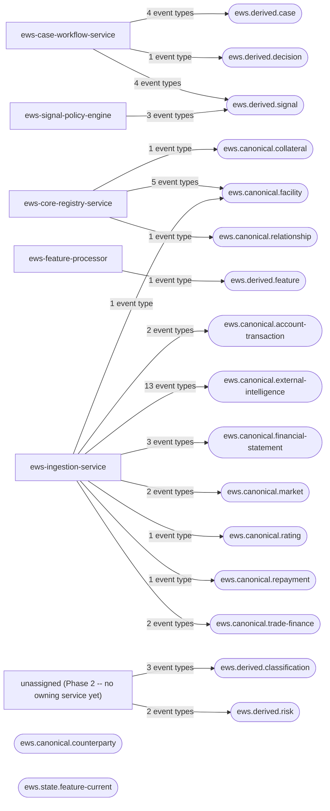

# EWS 2.0 — Generated Topic Flow Diagram

**Status:** Generated — do not hand-edit
**Source of truth:** `docs/architecture/topic-registry.json`
**Regenerate with:** `python3 scripts/generate_topic_flow_diagram.py` (checked for staleness by `python3 scripts/generate_topic_flow_diagram.py --check`, wired into CI)

Satisfies `docs/architecture/05-coherence-review-parts-i-iii.md` Section 5, backlog item 7 ("Add architecture diagrams generated from the normalized Parts I-III model"). Every node and edge below is derived directly from `topic-registry.json` — this file is regenerated whenever that registry changes, never hand-edited.

## Owner service → topic flow

## Full event → topic → owner mapping

| Event type | Topic | Key field | Owner | Data classification |
|---|---|---|---|---|
| `payment.instruction.returned` | `ews.canonical.account-transaction` | `accountId` | ews-ingestion-service | INTERNAL |
| `transaction.posted` | `ews.canonical.account-transaction` | `accountId` | ews-ingestion-service | INTERNAL |
| `collateral.valuation.updated` | `ews.canonical.collateral` | `collateralId` | ews-core-registry-service | INTERNAL |
| `credit.facility.amended` | `ews.canonical.external-intelligence` | `entityId` | ews-ingestion-service | CONFIDENTIAL |
| `debt.acceleration.disclosed` | `ews.canonical.external-intelligence` | `entityId` | ews-ingestion-service | CONFIDENTIAL |
| `debt.default.disclosed` | `ews.canonical.external-intelligence` | `entityId` | ews-ingestion-service | CONFIDENTIAL |
| `facility.maturity.extended` | `ews.canonical.external-intelligence` | `entityId` | ews-ingestion-service | CONFIDENTIAL |
| `facility.pricing.changed` | `ews.canonical.external-intelligence` | `entityId` | ews-ingestion-service | CONFIDENTIAL |
| `financial.reporting.non_reliance.disclosed` | `ews.canonical.external-intelligence` | `entityId` | ews-ingestion-service | CONFIDENTIAL |
| `insolvency.proceeding.started` | `ews.canonical.external-intelligence` | `entityId` | ews-ingestion-service | CONFIDENTIAL |
| `insolvency.proceeding.status.changed` | `ews.canonical.external-intelligence` | `entityId` | ews-ingestion-service | CONFIDENTIAL |
| `internal.control.weakness.disclosed` | `ews.canonical.external-intelligence` | `entityId` | ews-ingestion-service | CONFIDENTIAL |
| `management.position.changed` | `ews.canonical.external-intelligence` | `entityId` | ews-ingestion-service | CONFIDENTIAL |
| `ownership.control.changed` | `ews.canonical.external-intelligence` | `entityId` | ews-ingestion-service | CONFIDENTIAL |
| `security.interest.created` | `ews.canonical.external-intelligence` | `entityId` | ews-ingestion-service | CONFIDENTIAL |
| `security.interest.released` | `ews.canonical.external-intelligence` | `entityId` | ews-ingestion-service | CONFIDENTIAL |
| `covenant.measurement.updated` | `ews.canonical.facility` | `facilityId` | ews-core-registry-service | INTERNAL |
| `covenant.waiver.disclosed` | `ews.canonical.facility` | `facilityId` | ews-ingestion-service | INTERNAL |
| `facility.drawing_power.changed` | `ews.canonical.facility` | `facilityId` | ews-core-registry-service | INTERNAL |
| `facility.limit.changed` | `ews.canonical.facility` | `facilityId` | ews-core-registry-service | INTERNAL |
| `facility.outstanding.changed` | `ews.canonical.facility` | `facilityId` | ews-core-registry-service | INTERNAL |
| `monitoring.requirement.status.changed` | `ews.canonical.facility` | `counterpartyId` | ews-core-registry-service | INTERNAL |
| `financial.statement.received` | `ews.canonical.financial-statement` | `counterpartyId` | ews-ingestion-service | CONFIDENTIAL |
| `financial.statement.restated` | `ews.canonical.financial-statement` | `counterpartyId` | ews-ingestion-service | CONFIDENTIAL |
| `financial.statement.validated` | `ews.canonical.financial-statement` | `counterpartyId` | ews-ingestion-service | CONFIDENTIAL |
| `market.bond.trade.observed` | `ews.canonical.market` | `securityId` | ews-ingestion-service | CONFIDENTIAL |
| `market.security.reference.changed` | `ews.canonical.market` | `securityId` | ews-ingestion-service | CONFIDENTIAL |
| `rating.action.published` | `ews.canonical.rating` | `entityId` | ews-ingestion-service | CONFIDENTIAL |
| `relationship.changed` | `ews.canonical.relationship` | `relationshipId` | ews-core-registry-service | INTERNAL |
| `obligation.dpd.changed` | `ews.canonical.repayment` | `facilityId` | ews-ingestion-service | INTERNAL |
| `trade_finance.guarantee.invoked` | `ews.canonical.trade-finance` | `facilityId` | ews-ingestion-service | INTERNAL |
| `trade_finance.lc.devolved` | `ews.canonical.trade-finance` | `facilityId` | ews-ingestion-service | INTERNAL |
| `case.assigned` | `ews.derived.case` | `caseId` | ews-case-workflow-service | INTERNAL |
| `case.closed` | `ews.derived.case` | `caseId` | ews-case-workflow-service | INTERNAL |
| `case.escalated` | `ews.derived.case` | `caseId` | ews-case-workflow-service | INTERNAL |
| `case.opened` | `ews.derived.case` | `caseId` | ews-case-workflow-service | INTERNAL |
| `classification.state.approved` | `ews.derived.classification` | `entityId` | unassigned (Phase 2 -- no owning service yet) | RESTRICTED |
| `classification.state.changed` | `ews.derived.classification` | `entityId` | unassigned (Phase 2 -- no owning service yet) | RESTRICTED |
| `classification.state.proposed` | `ews.derived.classification` | `entityId` | unassigned (Phase 2 -- no owning service yet) | RESTRICTED |
| `signal.disposition.recorded` | `ews.derived.decision` | `caseId or decision subject` | ews-case-workflow-service | CONFIDENTIAL |
| `feature.value.updated` | `ews.derived.feature` | `entityId` | ews-feature-processor | INTERNAL |
| `risk.assessment.approved` | `ews.derived.risk` | `counterpartyId` | unassigned (Phase 2 -- no owning service yet) | CONFIDENTIAL |
| `risk.assessment.proposed` | `ews.derived.risk` | `counterpartyId` | unassigned (Phase 2 -- no owning service yet) | CONFIDENTIAL |
| `signal.accepted` | `ews.derived.signal` | `counterpartyId` | ews-case-workflow-service | INTERNAL |
| `signal.detected` | `ews.derived.signal` | `counterpartyId` | ews-signal-policy-engine | INTERNAL |
| `signal.proposed` | `ews.derived.signal` | `counterpartyId` | ews-signal-policy-engine | INTERNAL |
| `signal.rejected` | `ews.derived.signal` | `counterpartyId` | ews-case-workflow-service | INTERNAL |
| `signal.reopened` | `ews.derived.signal` | `counterpartyId` | ews-case-workflow-service | INTERNAL |
| `signal.resolved` | `ews.derived.signal` | `counterpartyId` | ews-case-workflow-service | INTERNAL |
| `signal.updated` | `ews.derived.signal` | `counterpartyId` | ews-signal-policy-engine | INTERNAL |

## Declared topics and retention modes

| Topic | Retention mode | Notes |
|---|---|---|
| `ews.canonical.counterparty` | delete + optional compacted projection | low/moderate volume |
| `ews.canonical.facility` | delete | strict facility transition ordering |
| `ews.canonical.account-transaction` | delete | highest-volume corporate stream; avoid counterparty hot key |
| `ews.canonical.repayment` | delete | facility sequence important |
| `ews.canonical.trade-finance` | delete | instrument/facility semantics |
| `ews.canonical.financial-statement` | delete | long analytical relevance |
| `ews.canonical.collateral` | delete | facilities linked by references |
| `ews.canonical.rating` | delete | preserve provider/source evidence |
| `ews.canonical.relationship` | delete | temporal graph edges |
| `ews.canonical.external-intelligence` | delete | source-rights and resolution metadata required |
| `ews.canonical.market` | short delete retention | high-volume facts become issuer features downstream |
| `ews.derived.feature` | delete history | separate current-state topic where required |
| `ews.state.feature-current` | compacted | latest feature value only, per 03c Section 3 |
| `ews.derived.signal` | delete | analytical signal history |
| `ews.derived.risk` | delete | audit history |
| `ews.derived.classification` | delete | namespace carried in payload; separate from EWS signal state |
| `ews.derived.decision` | delete | human governance |
| `ews.derived.case` | delete | workflow transitions |

